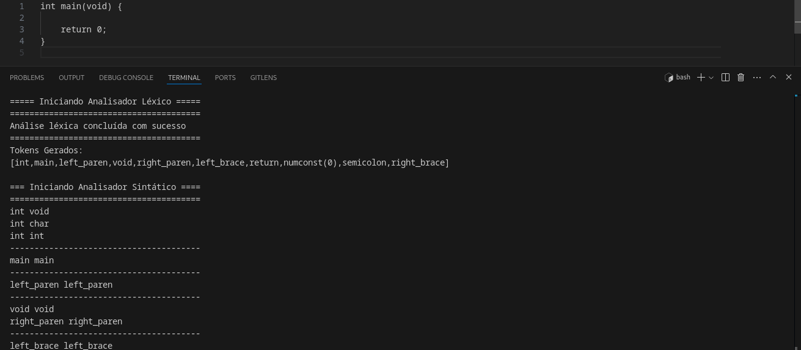
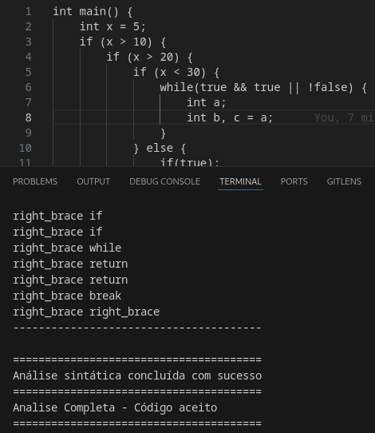

# *g--*, um compilador para a linguagem *C--*

> *"C makes it easy to shoot yourself in the foot; C++ makes it harder, but when you do it blows your whole leg off. "* ― Bjarne Stroustrup

**Disciplina**: FGA0210 - PARADIGMAS DE PROGRAMAÇÃO - T01 <br>
**Número do Grupo**: 02<br>
**Paradigma**: Lógico<br>

## Alunos
| Matrícula  | Aluno                              |
| ---------- | ---------------------------------- |
| 21/1039288 | Bruno Campos Ribeiro               |
| 21/1039297 | Bruno Martins Valério Bomfim       |
| 20/2016462 | Heitor Marques                     |
| 21/1029352 | Igor e Silva Penha                 |
| 19/0057858 | José Luís Ramos Teixeira           |
| 21/1029405 | Leonardo Gonçalves Machado         |
| 20/2016767 | Lucas Felipe Soares                |
| 20/0062379 | Marcos Vinícius de Deus            |
| 20/2045268 | Raquel T. Eucaria Pereira da Costa |
| 21/2002907 | Zenilda Pedrosa Vieira             |


## Sobre

**g--** é o projeto de um possível compilador desenvolvido em Prolog para a
linguagem fictícia C--, que representa um subconjunto simplificado da linguagem
C.  Criado com o objetivo de explorar conceitos fundamentais de compiladores,
linguagens de programação e o paradigma lógico de programação, o **g--** busca
processar o código-fonte escrito em C--, verificando sua correctude léxica e
sintática.

### A Linguagem C--

<center>
<div align='center'>
<br>
<label><b>Imagem 1:</b> Logo do C-- (Fonte: Bruno Martins).</label><br><br>
</div>
</center>

C-- é projetada como um subset da linguagem C, contendo apenas os recursos
essenciais da linguagem para facilitar o processo de análise e compilação.
Algumas de suas características incluem:

- Tipos de dados básicos: `int`, `char`, `void`, além de constantes como `true`
  e `false`.
- Estruturas de controle: `if`, `else`, `while`, e `return`.
- Declaração de variáveis: Permite declarações simples e inicializações.
- Função principal: O ponto de entrada do programa é uma função `main()` obrigatória.
- Expressões matemáticas: Suporte a operadores aritméticos (`+`, `-`, `*`, `/`,
  `%`) e relacionais (`<`, `>`, `==`, etc.).

O C-- elimina recursos mais complexos do C, como funções e ponteiros,
tornando a linguagem mais factível para o projeto da disciplina.

#### Estrutura do Compilador g--:

1. **Análise Léxica:** O analisador léxico transforma o código-fonte em uma
sequência de tokens, representando as menores unidades significativas da
linguagem, como identificadores, números, operadores e palavras-chave.

2. **Análise Sintática:** O analisador sintático utiliza um conjunto de regras
gramaticais para verificar se a sequência de tokens forma estruturas válidas em
C--. Essa etapa é implementada como um parser descendente recursivo em Prolog, 
utilizando predicados para cada produção da gramática.

## Screenshots


<center>
<div align='center'>
<label><b>Imagem 2:</b> Mensagem de boas-vindas do compilador (Fonte: Bruno Martins).</label><br><br>
</div>
</center>




<center>
<div align='center'>
<label><b>Imagem 3:</b> Exemplo da execução do caso de teste 1, disponível na pasta "testes" (Fonte: Bruno Martins e Lucas Soares).</label><br><br>
</div>
</center>





<center>
<div align='center'>
<label><b>Imagem 4:</b> Exemplo da execução do caso de teste 3, disponível na pasta "testes" (Fonte: Bruno Martins e Lucas Soares).</label><br><br>
</div>
</center>


## Instalação e Configuração do Ambiente
Siga os passos abaixo para configurar o ambiente e executar o programa:

1. **Instale o SWI-Prolog**:
  - No Ubuntu/Debian:
    ```bash
    sudo apt-get update
    sudo apt-get install swi-prolog
    ```
  - No Windows ou macOS, baixe e instale a partir do [site oficial do SWI-Prolog](https://www.swi-prolog.org/).

2. **Baixe o repositório do projeto g--**:
  - Via ssh:
    ```bash
    git clone git@github.com:UnBParadigmas2024-2/2024.2_G2_Logico_CompiladorC--.git
    ```
  - Via https:
    ```bash
    git clone https://github.com/UnBParadigmas2024-2/2024.2_G2_Logico_CompiladorC--.git
    ```

3. **Navegue até a pasta raiz do repositório**:
    ```bash
    cd 2024.2_G2_Logico_CompiladorC--/
    ```
  
4. **Verifique a instalação**:
    
    Para verificar a integridade da instalação do seu compilador g--, execute o seguinte código descrito abaixo:

    ```bash
    swipl -s main.pl -g main
    ```
    
    É esperado que apareça na tela a seguinte mensagem:

    ```bash
    === g-- Versão 1.0.0 | 13 de dezembro de 2024 ===
    Autores: Bruno Ribeiro, Bruno Martins, Heitor Marques,
    Igor Penha, José Luís Teixeira, Leonardo Machado, Lucas Soares,
    Marcos de Deus, Raquel Eucária e Zenilda Vieira

    Seu compilador g-- foi instalado corretamente!
    Compile seu código c-- com "swipl -s main.pl -g main -- <filename>.cmm"
    ```

    Este processo é descrito visualmente abaixo, utilizando o clone ssh:

    

    <center>
  <div align='center'>
  <label><b>Imagem 5:</b> Processo de configuração do ambiente (Fonte: Bruno Martins).</label><br><br>
  </div>
  </center>


## Uso
Para utilizar o compilador g--, é necessário que você crie um arquivo com extensão .cmm empregando corretamente expressões válidas da linguagem C--, por meio de qualquer editor de texto ou IDE de sua preferência. Em seguida, basta inserir no terminal o seguinte comando:

```bash
swipl -s main.pl -g main -- <nome-do-arquivo>.cmm
```

A título de exemplo, vamos criar o programa `teste.cmm` definido abaixo:

```bash
int main(void) {
	return 0;
}
```

Na sequência, bastaria executar no seu terminal:
```bash
swipl -s main.pl -g main -- teste.cmm
```

## Vídeo

## Participações

| **Nome do Membro**            | **Contribuição**                              | **Significância da Contribuição** (Excelente/Boa/Regular/Ruim/Nula) | **Comprobatórios** (ex. links para commits) |
|-------------------------------|-----------------------------------------------|--------------------------------------------------------------------|---------------------------------------------|
| Bruno Campos Ribeiro          |                                               |                                                                    |                                             |
| Bruno Martins Valério Bomfim  |                                               |                                                                    |                                             |
| Heitor Marques                |                                               |                                                                    |                                             |
| Igor e Silva Penha            |                                               |                                                                    |                                             |
| José Luís Ramos Teixeira      |                                               |                                                                    |                                             |
| Leonardo Gonçalves Machado    |                                               |                                                                    |                                             |
| Lucas Felipe Soares           | Paticipação principalmente com a criação do analisador Léxico. Desde a geração da tabela de Tokens até a lógica em si. Participei revisando código e debbug também. Criei o presente respositório e a iniciação da documentação que fora avançada por colegas.                                               | Excelente                                                                   |[Analisador Léxico e organização dos arquivos](d86da91c40416ef0face2430cfa3bbaca70ee8ec) <br>[Base e criação de testes](5a8c3661369e464cd0ca1c18e02a4a36b8ba2883)<br>[Criação da Tabela de Tokens](16889339971738ac116ed8aac0a83bf93941a3b0)<br>[Criação do template de documentação do projeto](6f18b93e7cf44015e7168c33523df3faaf8f6df9)                                            |
| Marcos Vinícius de Deus       |                                               |                                                                    |                                             |
| Raquel T. Eucaria Pereira da Costa |                                           |                                                                    |                                             |
| Zenilda Pedrosa Vieira        |                                               |                                                                    |                                             |


## Outros

Acesso o relato de cada membro do grupo referente às lições aprendidas, percepções, contribuições, fragilidades e trabalhos futuros através dos links abaixo.

- [Bruno Campos Ribeiro]()
- [Bruno Martins Valério Bomfim](docs/relatos/bruno.md)
- [Heitor Marques]()
- [Igor e Silva Penha]()
- [José Luís Ramos Teixeira]()
- [Leonardo Gonçalves Machado]()
- [Lucas Felipe Soares]()
- [Marcos Vinícius de Deus]()
- [Raquel T. Eucaria Pereira da Costa]()
- [Zenilda Pedrosa Vieira]()

## Bibliografia

[1] AHO, Alfred V.; LAM, Monica S.; SETHI, Ravi; ULLMAN, Jeffrey D. **Compilers: Principles, Techniques, and Tools**. 2. ed. Boston: Pearson Addison Wesley, 2006.

[2] COSTA JÚNIOR, Edson Alves da. **Repositório da Disciplina de Compiladores 1**. Disponível em: [link](https://github.com/edsomjr/Compiladores). Acesso em: 10 dez. 2024.

[3] RIBAS, Bruno César. **Materiais da Disciplina de Compiladores 1**. Disponível em: [link](https://www.brunoribas.com.br/compiladores/2024-2/). Acesso em: 10 dez. 2024.

[4] SERRANO, Milene. **Materiais da Disciplina de Paradigmas de Programação**. Disponível em: [link](https://aprender3.unb.br/). Acesso em: 10 dez. 2024.
