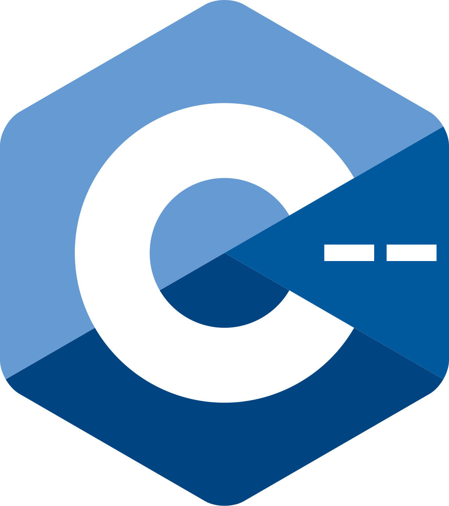
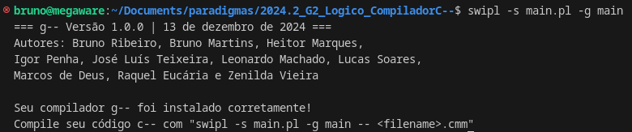
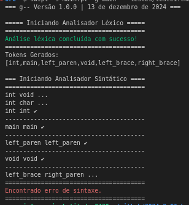
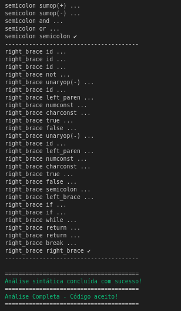

# *g--*, um compilador para a linguagem *C--*

> *"C makes it easy to shoot yourself in the foot; C++ makes it harder, but when you do it blows your whole leg off."* ― Bjarne Stroustrup

**Disciplina**: FGA0210 - PARADIGMAS DE PROGRAMAÇÃO - T01 <br>
**Número do Grupo**: 02<br>
**Paradigma**: Lógico<br>

## Alunos
| Matrícula  | Aluno                              |
| ---------- | ---------------------------------- |
| 21/1039288 | Bruno Campos Ribeiro               |
| 21/1039297 | Bruno Martins Valério Bomfim       |
| 20/2016462 | Heitor Marques                     |
| 21/1029352 | Igor e Silva Penha                 |
| 19/0057858 | José Luís Ramos Teixeira           |
| 21/1029405 | Leonardo Gonçalves Machado         |
| 20/2016767 | Lucas Felipe Soares                |
| 20/0062379 | Marcos Vinícius de Deus            |
| 20/2045268 | Raquel T. Eucária Pereira da Costa |
| 21/2002907 | Zenilda Pedrosa Vieira             |


## Sobre

**g--** é o projeto de um possível compilador desenvolvido em Prolog para a
linguagem fictícia C--, que representa um subconjunto simplificado da linguagem
C.  Criado com o objetivo de explorar conceitos fundamentais de compiladores,
linguagens de programação e o paradigma lógico de programação, o **g--** busca
processar o código-fonte escrito em C--, verificando sua corretude léxica e
sintática.

### A Linguagem C--

<div align='center'>
<br>
<label><strong>Imagem 1:</strong> Logo do C-- <br> <strong>Fonte:</strong> <a href="https://github.com/gitbmvb">Bruno Martins</a>, 2024.</label><br><br>
</div>

C-- é projetada como um subset da linguagem C, contendo apenas os recursos
essenciais da linguagem para facilitar o processo de análise e compilação.
Algumas de suas características incluem:

- Tipos de dados básicos: `int`, `char`, `void`, além de constantes como `true`
  e `false`.
- Estruturas de controle: `if`, `else`, `while`, e `return`.
- Declaração de variáveis: Permite declarações simples e inicializações.
- Função principal: O ponto de entrada do programa é uma função `main()` obrigatória.
- Expressões matemáticas: Suporte a operadores aritméticos (`+`, `-`, `*`, `/`,
  `%`) e relacionais (`<`, `>`, `==`, etc.).

O C-- elimina recursos mais complexos do C, como funções e ponteiros,
tornando a linguagem mais factível para o projeto da disciplina.

#### Estrutura do Compilador g--:

1. **Análise Léxica:** O analisador léxico transforma o código-fonte em uma
sequência de tokens, representando as menores unidades significativas da
linguagem, como identificadores, números, operadores e palavras-chave.

2. **Análise Sintática:** O analisador sintático utiliza um conjunto de regras
gramaticais para verificar se a sequência de tokens forma estruturas válidas em
C--. Essa etapa é implementada como um parser descendente recursivo em Prolog, 
utilizando predicados para cada produção da gramática.

Para uma leitura mais detalhada sobre os aspectos do compilador g--, acesse a nossa [documentação](docs/descricaoCompiladorC--.md) na íntegra.

## Screenshots

<div align='center'>
  <br><br>
  <label><strong> Imagem 2:</strong> Mensagem de boas-vindas do compilador <br> <strong>Fonte:</strong> <a href="https://github.com/gitbmvb">Bruno Martins</a>, 2024.</label><br><br><br>
  <br><br>
  <label><strong>Imagem 3:</strong> Exemplo da execução do caso de teste 1, disponível na pasta "testes"<br> <strong>Fonte:</strong> <a href="https://github.com/gitbmvb">Bruno Martins</a>, <a href="https://github.com/lucasfs1007">Lucas Soares</a> e <a href="https://github.com/raqueleucaria">Raquel Eucaria</a>, 2024.</label><br><br><br>
  <br><br>
  <label><strong>Imagem 4:</strong> Exemplo da execução do caso de teste 3, disponível na pasta "testes" <br>
    <strong>Fonte:</strong> <a href="https://github.com/gitbmvb">Bruno Martins</a>, <a href="https://github.com/lucasfs1007">Lucas Soares</a> e <a href="https://github.com/raqueleucaria">Raquel Eucaria</a>, 2024.</label><br><br><br>
</div>


## Instalação e Configuração do Ambiente
Siga os passos abaixo para configurar o ambiente e executar o programa:

1. **Instale o SWI-Prolog**:
  - No Ubuntu/Debian:
    ```bash
    sudo apt-get update
    sudo apt-get install swi-prolog
    ```
  - No Windows ou macOS, baixe e instale a partir do [site oficial do SWI-Prolog](https://www.swi-prolog.org/).

2. **Baixe o repositório do projeto g--**:
  - Via ssh:
    ```bash
    git clone git@github.com:UnBParadigmas2024-2/2024.2_G2_Logico_CompiladorC--.git
    ```
  - Via https:
    ```bash
    git clone https://github.com/UnBParadigmas2024-2/2024.2_G2_Logico_CompiladorC--.git
    ```

3. **Navegue até a pasta raiz do repositório**:
    ```bash
    cd 2024.2_G2_Logico_CompiladorC--/
    ```
  
4. **Verifique a instalação**:
    
    Para verificar a integridade da instalação do seu compilador g--, execute o seguinte código descrito abaixo:

    ```bash
    swipl -s main.pl -g main
    ```
    
    É esperado que apareça na tela a seguinte mensagem:

    ```bash
    === g-- Versão 1.0.0 | 13 de dezembro de 2024 ===
    Autores: Bruno Ribeiro, Bruno Martins, Heitor Marques,
    Igor Penha, José Luís Teixeira, Leonardo Machado, Lucas Soares,
    Marcos de Deus, Raquel Eucária e Zenilda Vieira

    Seu compilador g-- foi instalado corretamente!
    Compile seu código c-- com "swipl -s main.pl -g main -- <filename>.cmm"
    ```

    Este processo é descrito visualmente abaixo, utilizando o clone ssh:

    <div align='center'>
    <br><br>
    <label><strong>Imagem 5:</strong> Processo de configuração do ambiente <br> <strong>Fonte:</strong> <a href="https://github.com/gitbmvb">Bruno Martins</a>, 2024.</label><br><br>
    </div>


## Uso
Para utilizar o compilador g--, é necessário que você crie um arquivo com extensão .cmm **na pasta raiz do projeto**, empregando corretamente expressões válidas da linguagem C--, por meio de qualquer editor de texto ou IDE de sua preferência. Em seguida, basta inserir no terminal o seguinte comando:

```bash
swipl -s main.pl -g main -- <nome-do-arquivo>.cmm
```

A título de exemplo, vamos criar o programa `teste.cmm` definido abaixo:

```bash
int main(void) {
	return 0;
}
```

Na sequência, bastaria executar no seu terminal:
```bash
swipl -s main.pl -g main -- teste.cmm
```

## Vídeo

https://youtu.be/DpWAvbdxjz0

## Participações

| **Nome do Membro** | **Contribuição** | **Significância da Contribuição** (Excelente/Boa/Regular/Ruim/Nula) | **Comprobatórios** (ex. links para commits) |
|--|--|--|--|
| Bruno Campos Ribeiro | (1) Participação nas reuniões do grupo, definição e elicitação de requisitos para o projeto.<br>(2) Construção da gramática utilizada no projeto.<br>(3) Transcrição da gramática para código na análise sintática.<br>(4) Validação e Verificação do projeto de forma total, tanto análise léxica quanto sintática. | Excelente | [Commit 5e08b84](https://github.com/UnBParadigmas2024-2/2024.2_G2_Logico_CompiladorC--/commit/5e08b84f2f3bc486c681c4d812a1c8acb3aa383e)<br>[Commit 3b87c8c](https://github.com/UnBParadigmas2024-2/2024.2_G2_Logico_CompiladorC--/commit/3b87c8cac35da133171b937da3f6f6bb7bf66abc)<br>[Commit 24b1a6b](https://github.com/UnBParadigmas2024-2/2024.2_G2_Logico_CompiladorC--/commit/24b1a6b7a58c1d7cc79a5da756430ae28dfcc443)<br>[Commit 2ed4889](https://github.com/UnBParadigmas2024-2/2024.2_G2_Logico_CompiladorC--/commit/2ed488956e1eef3a13b463a3723c7c454120b444)<br>[Commit f37905a](https://github.com/UnBParadigmas2024-2/2024.2_G2_Logico_CompiladorC--/commit/f37905a120bcce3b6afe6519e8e6d24840c8fd96)<br>[Commit c47c95e](https://github.com/UnBParadigmas2024-2/2024.2_G2_Logico_CompiladorC--/commit/c47c95e9efde5f26d98518d18eb1d5170f2e039d)|
| Bruno Martins Valério Bomfim  | (1) Participação nas reuniões em grupo para definição do tema e demais requisitos do projeto.<br>(2) Análise sintática: revisão da gramática, transcrição das regras de produção para o Prolog, bug search nas expressões produzidas.<br>(3) Análise léxica: revisão do código e de pull requests.<br>(4) Verificação e Validação: geração de alguns casos de teste de código para testar a eficácia do compilador.<br>(5) Integração e organização: realização da integração das duas análises (léxica e sintática) e reorganização da estrutura do repositório.<br>(6) Documentação: produção do README, adição de comentários no código para facilitar o entendimento, correção de erros gramaticais nos textos, e produção do relato pessoal das atividades desenvolvidas (tópico "Outros").<br>(7) Participação da produção do vídeo da entrega. | Excelente | (1) Disponível do teams de Paradigmas, no Microsoft Teams.<br>(2) [Commit 125a5c5](https://github.com/UnBParadigmas2024-2/2024.2_G2_Logico_CompiladorC--/commit/125a5c54708a486cea1c5c7b0d3b10283b608b24)<br>(3) [Commit 92beef1](https://github.com/UnBParadigmas2024-2/2024.2_G2_Logico_CompiladorC--/commit/92beef1b1f7e063c0a488d8309aec4cd67a294fc), [Commit 1df6eec](https://github.com/UnBParadigmas2024-2/2024.2_G2_Logico_CompiladorC--/commit/1df6eecde36c352019559b879b27436fbcd8206c)<br>(4) [Commit f3b2d5a](https://github.com/UnBParadigmas2024-2/2024.2_G2_Logico_CompiladorC--/commit/f3b2d5a7750113f6a8ca428a6792ece3d2349e5d)<br>(5) [Commit 7461770](https://github.com/UnBParadigmas2024-2/2024.2_G2_Logico_CompiladorC--/commit/746177000b8ef784c9eea6fe899e32bb3545ff28), [Commit 5a53465](https://github.com/UnBParadigmas2024-2/2024.2_G2_Logico_CompiladorC--/commit/5a5346527acf03618d65c6c21b9a0e49f7f720bf)<br>(6) [Commit f37905a](https://github.com/UnBParadigmas2024-2/2024.2_G2_Logico_CompiladorC--/commit/f37905a120bcce3b6afe6519e8e6d24840c8fd96), [Commit 478e43c](https://github.com/UnBParadigmas2024-2/2024.2_G2_Logico_CompiladorC--/commit/478e43c15a9ad5e33cfe652fe97e0bd3bb13eb70), [Commit 412fdaf](https://github.com/UnBParadigmas2024-2/2024.2_G2_Logico_CompiladorC--/commit/412fdaff4bac337de4f27b9d093f3dbdfb51cf6e), [Commit fe72166](https://github.com/UnBParadigmas2024-2/2024.2_G2_Logico_CompiladorC--/commit/fe72166af122519cbb1ee86e980800f75dd13e79), [Commit c3d9d24](https://github.com/UnBParadigmas2024-2/2024.2_G2_Logico_CompiladorC--/commit/c3d9d2414c592875f17dd66152f06b1f02a7291d), [Commit c22b26e](https://github.com/UnBParadigmas2024-2/2024.2_G2_Logico_CompiladorC--/commit/c22b26e49af675b59c7d6784ee173db5d68dd074)<br>(7) [Vídeo](https://github.com/UnBParadigmas2024-2/2024.2_G2_Logico_CompiladorC--#v%C3%ADdeo) |
| Heitor Marques                | Participei da reunião inicial do grupo via Teams para definição do tema e requisitos do projeto. Testes iniciais com a criação de um analisador léxico com base na gramatica proposta para o c--, refatoração no código léxico com base no código base que havia criado e ajustes de erros no analisador léxico. Participação no video. | Excelente | [Lista de Commits](https://github.com/UnBParadigmas2024-2/2024.2_G2_Logico_CompiladorC--/commits?author=heitormsb) |
| Igor e Silva Penha            |                                               |                                                                    |                                             |
| José Luís Ramos Teixeira      | Participei da reunião inicial do grupo via Teams para definição do tema e requisitos do projeto. Contribuição significativa na construção e refatoração do analisador léxico, desde a organização dos arquivos até ajustes na base de tokens, seguindo a gramática do projeto. Participei também na documentação inicial do módulo léxico e no vídeo final em grupo. | Excelente | [Léxico com arquivos organizados](https://github.com/UnBParadigmas2024-2/2024.2_G2_Logico_CompiladorC--/commit/d86da91c40416ef0face2430cfa3bbaca70ee8ec) <br>[Documentação inicial](https://github.com/UnBParadigmas2024-2/2024.2_G2_Logico_CompiladorC--/commit/6c0eea520143f0ae6ce472a8f6aa4b5e4f50e2a6) <br>[Refatoração da base léxica](https://github.com/UnBParadigmas2024-2/2024.2_G2_Logico_CompiladorC--/commit/ed1b013b5efc9d2e55736ef648f21702dd15f947) <br>[Ajuste no analisador léxico](https://github.com/UnBParadigmas2024-2/2024.2_G2_Logico_CompiladorC--/commit/b4ed1f305ca53ce0326e74eeef690d988a3bf003) <br>[Participação no vídeo](https://github.com/UnBParadigmas2024-2/2024.2_G2_Logico_CompiladorC--#v%C3%ADdeo) |
| Leonardo Gonçalves Machado    |                                               |                                                                    |                                             |
| Lucas Felipe Soares           | Participação principalmente com a criação do analisador Léxico. Desde a geração da tabela de Tokens até a lógica em si. Participei revisando código e debug também. Criei o presente repositório e a iniciação da documentação que fora avançada por colegas.                                               | Excelente                                                                   |[Analisador Léxico e organização dos arquivos](d86da91c40416ef0face2430cfa3bbaca70ee8ec) <br>[Base e criação de testes](5a8c3661369e464cd0ca1c18e02a4a36b8ba2883)<br>[Criação da Tabela de Tokens](16889339971738ac116ed8aac0a83bf93941a3b0)<br>[Criação do template de documentação do projeto](6f18b93e7cf44015e7168c33523df3faaf8f6df9)                                            |
| Marcos Vinícius de Deus       | Participação mais ativa na criação do analisador Léxico. Principalmente na geração da tabela de tokens. Contribuí em alguns pontos da documentação também, como criação do documento de descrição do nosso projeto. Outro ponto que contribuí foi com a elaboração do roteiro do vídeo e edição do mesmo| Boa | [Analisador léxico](https://github.com/UnBParadigmas2024-2/2024.2_G2_Logico_CompiladorC--/commit/2ed288d3c2c5187291e220bbe402caff5664072e) <br> [Documentação](https://github.com/UnBParadigmas2024-2/2024.2_G2_Logico_CompiladorC--/commit/b6bd1cf048c72e0408c40b019137b1225bdb4df2) <br> [Roteiro do vídeo](https://github.com/UnBParadigmas2024-2/2024.2_G2_Logico_CompiladorC--/issues/6) <br> [Vídeo](https://youtu.be/DpWAvbdxjz0)|
| Raquel T. Eucária Pereira da Costa | Participação nas reuniões em grupo para definição do tema e demais requisitos do projeto. <br> Desenvolvimento do Analisador Sintático. <br> Ajustes na saída do sistema. <br> Documentação sobre o projeto e README. <br> Participação no vídeo e na edição dele.   | Boa  | [Gramática](https://github.com/UnBParadigmas2024-2/2024.2_G2_Logico_CompiladorC--/commit/3b87c8cac35da133171b937da3f6f6bb7bf66abc)<br> [Analisador](https://github.com/UnBParadigmas2024-2/2024.2_G2_Logico_CompiladorC--/commit/2ed488956e1eef3a13b463a3723c7c454120b444)<br> [Ajuste saída](https://github.com/UnBParadigmas2024-2/2024.2_G2_Logico_CompiladorC--/commit/45ac280d032d9d4e3abfd50458b748425f1f963d)<br> [Documentação](https://github.com/UnBParadigmas2024-2/2024.2_G2_Logico_CompiladorC--/commit/5215a258564c6da5fa7c0b9a91ef62ab3e257f44)<br> [README](https://github.com/UnBParadigmas2024-2/2024.2_G2_Logico_CompiladorC--/commit/ed55b4c8b5d3beb6fb0f9b51368becaa5fc382d7)  |
| Zenilda Pedrosa Vieira        |   Participação nas discussões em grupo para definição do tema e demais requisitos do projeto.<br>Conversão do arquivo inicial em prolog de um compilador de Pascal simplificado codificado em Python por mim na disciplina de Compiladores (2024.01). Esse algoritmo foi utilizado como base inicial para o compilador g--.<br> Análise léxica: revisão do código, inclusão de comentários para maior legibilidade do código e inclusão de mensagens.<br>Análise Sintática: revisão do código, inclusão de mensagens de erro sintático e correção de loop infinito.<br> Alguns testes de código para verificar o compilador.<br> Documentação: adição do relato pessoal das atividades desenvolvidas (tópico "Outros").<br>Participação no vídeo da entrega. |  Boa (infelizmente problemas de saúde me impediram de contribuir mais)                                        |    [Testes em Pascal 1](https://github.com/UnBParadigmas2024-2/2024.2_G2_Logico_CompiladorC--/commit/f7498d4363440763aae5359a27f99d6e3eceff60)<br>[Testes em Pascal 2](https://github.com/UnBParadigmas2024-2/2024.2_G2_Logico_CompiladorC--/commit/3c8e567b283db7dba15dce9d5aa2ff32ff0b17e7)<br>[Inclusão de mensagens de erro quando o código não for aceito  1](https://github.com/UnBParadigmas2024-2/2024.2_G2_Logico_CompiladorC--/commit/eb8dc8e94cfb376e52138c25f97d429420ec2242)<br>[Inclusão de mensagens de erro quando o código não for aceito 2](https://github.com/UnBParadigmas2024-2/2024.2_G2_Logico_CompiladorC--/commit/142d62e64e109caac0399a4d81ae532f70af3556)<br>[Melhora da legibilidade da saída da analise sintática](https://github.com/UnBParadigmas2024-2/2024.2_G2_Logico_CompiladorC--/commit/27b5e2df06ff7de57a111ee7abfd2f9b4daa3dd9)<br>[Inclusão de comentários para melhorar legibilidade do código](https://github.com/UnBParadigmas2024-2/2024.2_G2_Logico_CompiladorC--/commit/9b8b77c24b87069b4116f36b6c697c61efe47665)<br>[Documentação]()           |

## Outros

Acesse o relato de cada membro do grupo referente às lições aprendidas, percepções, contribuições, fragilidades e trabalhos futuros através dos links abaixo:

- [Bruno Campos Ribeiro](docs/relatos/brunoRibeiro.md)
- [Bruno Martins Valério Bomfim](docs/relatos/brunoMartins.md)
- [Heitor Marques](docs/relatos/heitor.md)
- [Igor e Silva Penha](docs/relatos/igor.md)
- [José Luís Ramos Teixeira](docs/relatos/jose.md)
- [Leonardo Gonçalves Machado](docs/relatos/leonardo.md)
- [Lucas Felipe Soares](docs/relatos/lucas.md)
- [Marcos Vinícius de Deus](docs/relatos/marcos.md)
- [Raquel T. Eucária Pereira da Costa](docs/relatos/raquel.md)
- [Zenilda Pedrosa Vieira](docs/relatos/zenilda.md)

## Bibliografia

[1] AHO, Alfred V.; LAM, Monica S.; SETHI, Ravi; ULLMAN, Jeffrey D. **Compilers: Principles, Techniques, and Tools**. 2. ed. Boston: Pearson Addison Wesley, 2006.  

[2] FREE SOFTWARE FOUNDATION. GNU Compiler Collection (GCC). Disponível em: [link](https://gcc.gnu.org/onlinedocs/). Acesso em: 11 dez. 2024.

[3] WILDER, Michael. **CS445 - Compiler Design**. University of Idaho. Disponível em: [link](http://www2.cs.uidaho.edu/~mdwilder/cs445/). Acesso em: 4 dez. 2024.

[4] COSTA JÚNIOR, Edson Alves da. **Repositório da Disciplina de Compiladores 1**. Faculdade de Ciências e Tecnologias em Engenharia (FCTE) – Campus Gama, Universidade de Brasília (UnB). Disponível em: [link](https://github.com/edsomjr/Compiladores). Acesso em: 10 dez. 2024.  

[5] RIBAS, Bruno César. **Materiais da Disciplina de Compiladores 1**. Faculdade de Ciências e Tecnologias em Engenharia (FCTE) – Campus Gama, Universidade de Brasília (UnB). Disponível em: [link](link). Acesso em: 10 dez. 2024.  

[6] SERRANO, Milene. **Materiais da Disciplina de Paradigmas de Programação**. Faculdade de Ciências e Tecnologias em Engenharia (FCTE) – Campus Gama, Universidade de Brasília (UnB). Disponível em: [link](https://aprender3.unb.br/). Acesso em: 10 dez. 2024.  

[7] SANTIAGO, Judson. **Repositório da Disciplina de Compiladores**. Universidade Federal Rural do Semi-Árido (UFERSA). Disponível em: [link](https://github.com/JudsonSS/Compiladores). Acesso em: 10 dez. 2024.  

[8] WIKIPEDIA. **Backus–Naur Form**. Disponível em: [link](https://en.wikipedia.org/wiki/Backus%E2%80%93Naur_form). Acesso em: 10 dez. 2024.  
