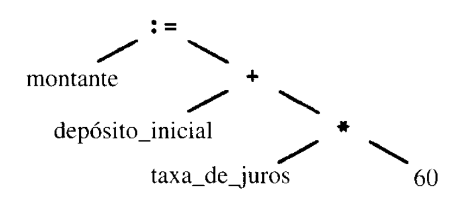

# Descrição do compilador do projeto C--

O projeto C-- implementa um compilador básico para uma linguagem de programação de escopo reduzido, inspirada na sintaxe do C. Este compilador foi desenvolvido em Prolog e foca principalmente na análise léxica e sintática, cobrindo um subconjunto de construções como declarações, condicionais e operações aritméticas.

O objetivo do projeto é demonstrar a viabilidade de usar Prolog, uma linguagem de programação lógica, como ferramenta para o desenvolvimento de compiladores, explorando suas capacidades de correspondência de padrões e manipulação de estruturas de dados.

## Introdução

Um compilador é uma ferramenta essencial no desenvolvimento de software, permitindo a tradução de linguagens de alto nível para código executável. Este projeto busca apresentar uma abordagem educacional para a criação de compiladores, utilizando a linguagem Prolog para implementar as etapas iniciais do processo: análise léxica e sintática.

A análise léxica identifica as unidades básicas do programa (tokens), como palavras-chave, identificadores e operadores. Já a análise sintática verifica se a sequência de tokens segue as regras gramaticais da linguagem.

A escolha do Prolog foi motivada pela sua natureza declarativa, que simplifica a especificação e a validação de gramáticas. O escopo reduzido da linguagem C-- foi definido para balancear complexidade e viabilidade, devido à limitação de tempo, permitindo a aplicação de conceitos fundamentais de compilação sem a necessidade de um ambiente de execução complexo.

## Metodologia

## Definição da gramática
A [gramática](../grammarc--) desenvolvida para o compilador **g-**- é definida pelo conjunto de produções da linguagem e segue o padrão Backus-Naur Form (BNF). Nessa definição:
- `<symbol>` representa uma variável não terminal, sempre delimitada pelo par de símbolos `< >`.
- `::=` indica que o símbolo à esquerda deve ser substituído pela expressão à direita.
- `__expression__` consiste em uma ou mais sequências de símbolos terminais ou não terminais, separadas por uma barra vertical `|` indicando uma escolha, sendo o todo uma possível substituição para o símbolo à esquerda.

Neste escopo, a gramática apresenta um conjunto FIRST disjunto e está livre de recursão à esquerda. Essas características eliminam a necessidade de ajustes adicionais, como a construção de um tradutor, e permitem a implementação direta de um analisador sintático.

## Etapas da compilação desenvolvidas

### Análise léxica

### Análise sintática
O analisador sintático tem como objetivo agrupar várias palavras (tokens) para formar uma sequência que seja validada conforme as regras da sintaxe. Caso a sequência esteja correta, ele gera uma representação em forma de árvore que reflete a estrutura gramatical dos tokens. 

A árvore sintática, como ilustrado na figura X, servirá de base para o analisador semântico prosseguir com a próxima fase do processo de compilação.

  <figure style="display: inline-block; margin-right: 20px;">
    
   <figcaption> <strong>Imagem X</strong>: Exemplo de árvore sintática   <strong>Fonte:</strong> AHO, Alfred V. et al. Compilers: Principles, Techniques, and Tools, 2006</figcaption>
  </figure>

No projeto, será desenvolvida a primeira etapa: a **verificação dos tokens**, utilizando o conjunto de regras gramaticais definidas para estruturar o código em C--.

Esta etapa será implementada por meio de um parser descendente recursivo em Prolog, que utilizará predicados correspondentes a cada produção da gramática.

## Bibliografia

[1] AHO, Alfred V.; LAM, Monica S.; SETHI, Ravi; ULLMAN, Jeffrey D. **Compilers: Principles, Techniques, and Tools**. 2. ed. Boston: Pearson Addison Wesley, 2006.  

[2] FREE SOFTWARE FOUNDATION. GNU Compiler Collection (GCC). Disponível em: [link](https://gcc.gnu.org/onlinedocs/). Acesso em: 11 dez. 2024.

[3] WILDER, Michael. **CS445 - Compiler Design**. University of Idaho. Disponível em: [link](http://www2.cs.uidaho.edu/~mdwilder/cs445/). Acesso em: 4 dez. 2024.

[4] COSTA JÚNIOR, Edson Alves da. **Repositório da Disciplina de Compiladores 1**. Faculdade de Ciências e Tecnologias em Engenharia (FCTE) – Campus Gama, Universidade de Brasília (UnB). Disponível em: [link](https://github.com/edsomjr/Compiladores). Acesso em: 10 dez. 2024.  

[5] RIBAS, Bruno César. **Materiais da Disciplina de Compiladores 1**. Faculdade de Ciências e Tecnologias em Engenharia (FCTE) – Campus Gama, Universidade de Brasília (UnB). Disponível em: [link](link). Acesso em: 10 dez. 2024.  

[6] SERRANO, Milene. **Materiais da Disciplina de Paradigmas de Programação**. Faculdade de Ciências e Tecnologias em Engenharia (FCTE) – Campus Gama, Universidade de Brasília (UnB). Disponível em: [link](https://aprender3.unb.br/). Acesso em: 10 dez. 2024.  

[7] SANTIAGO, Judson. **Repositório da Disciplina de Compiladores**. Universidade Federal Rural do Semi-Árido (UFERSA). Disponível em: [link](https://github.com/JudsonSS/Compiladores). Acesso em: 10 dez. 2024.  

[8] WIKIPEDIA. **Backus–Naur Form**. Disponível em: [link](https://en.wikipedia.org/wiki/Backus%E2%80%93Naur_form). Acesso em: 10 dez. 2024.  

## Histórico de versões

| Versão | Data       | Descrição                                                                      |                                                 Autor                                                 |
| :----: | ---------- | ------------------------------------------------------------------------------ | :---------------------------------------------------------------------------------------------------: |
| `1.0`  | 10/12/2024 | Criação do documento e adição da introdução                                          | [Marcos Vinícius](https://github.com/Marcos574)  |
| `1.1`  | 11/12/2024 | Adição da gramática e do sintático                                          | [Raquel Eucaria](https://github.com/raqueleucaria)  |

